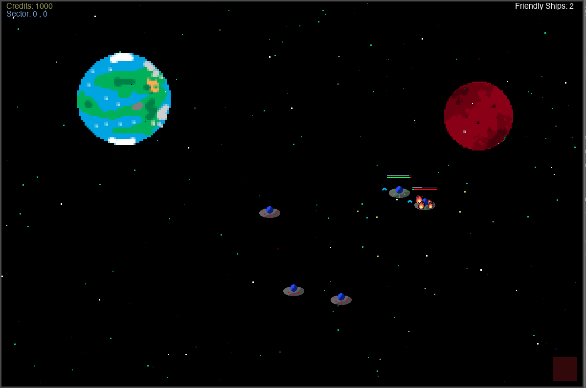
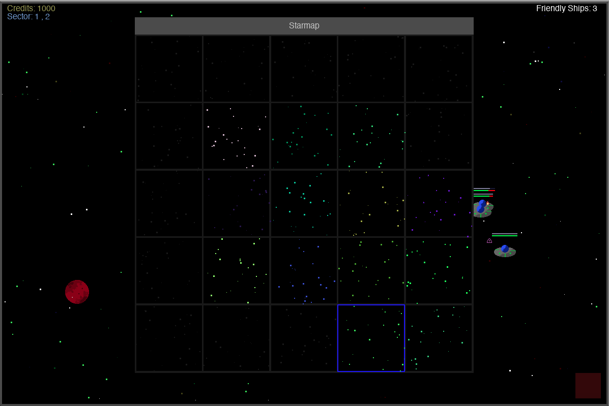
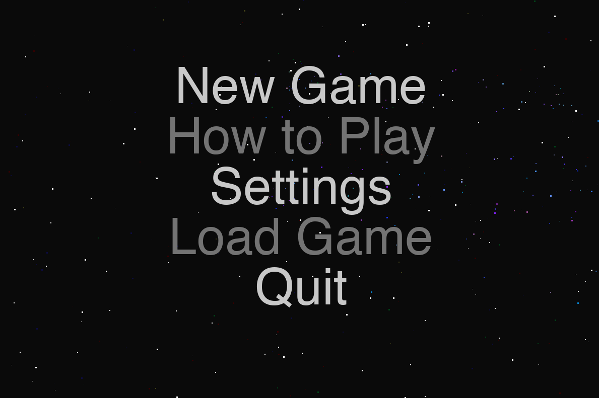

# A Simple Pygame Strategy Game #
Just a project to help me learn2code :D 

## The Game ##

Build a fleet and fight the evil alien overlords!

Explore all of the regions, find the big boss, and take him out!

Change settings such as difficulty!

...and much more!

## Linux/Mac Environment Setup ##
- Get virtualenv with: <code>pip3 install virtualenv</code> This should add virtualenv to the system. 
- To create a virtual env, now use <code>python3 -m venv env_name</code> this will create a virtual env in a folder by that name
- Activate the env by using <code>source env_name/bin/activate</code> 
- To use a requirements file type <code>pip install -r requirements.txt</code> 

## how to play ##
I haven't implemented the explanation into the game yet… essentially you jump from zone to zone, building up a fleet. The goal is to destroy the enemy boss ship. It plays like a traditional RTS where you select ships with boxes, or by left clicking on them. Right clicking is a move order. Other commands are:
- q puts ships into an autonomous fighting mode. You can still issue move/fire commands in this mode. 
- s stops all ships
- w brings up the starmap menu. To warp ships, have them selected in this window and click on an adjacent square. 
- a will make all selected ships fire in the direction of the mouse’s x,y coordinates. Ship accuracy is linked to the number of kills that ship has. 

Still needs work… obviously… some dev tools are still there
- p spawns a planet
- i spawns a friendly ship
- o spawns an enemy ship
- c clears everything (except enemy ships because I forgot about them) 

When I have time someday I’ll finish the UI and explanations, then package it as a .app. That’s a little ways away though. 

## known issues ##
Some operating systems may not have a suitable font, so all text might appear as squares. Will fix someday...

